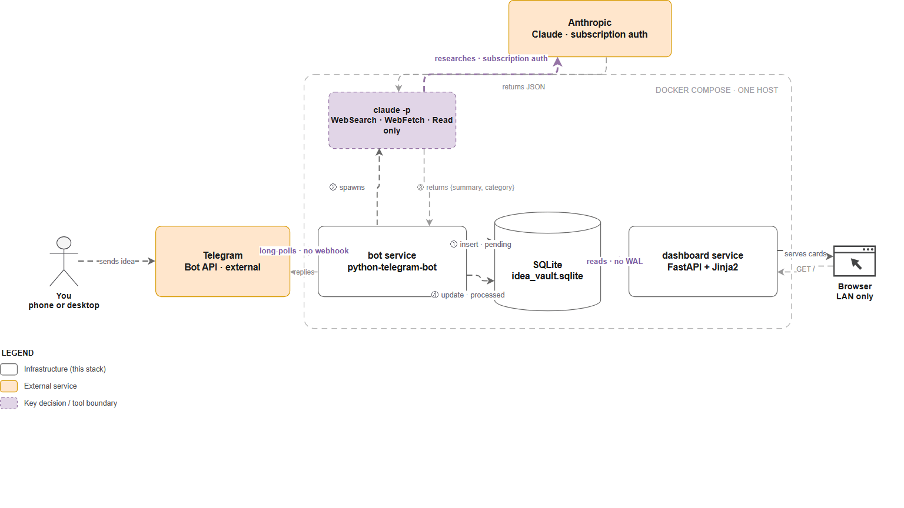
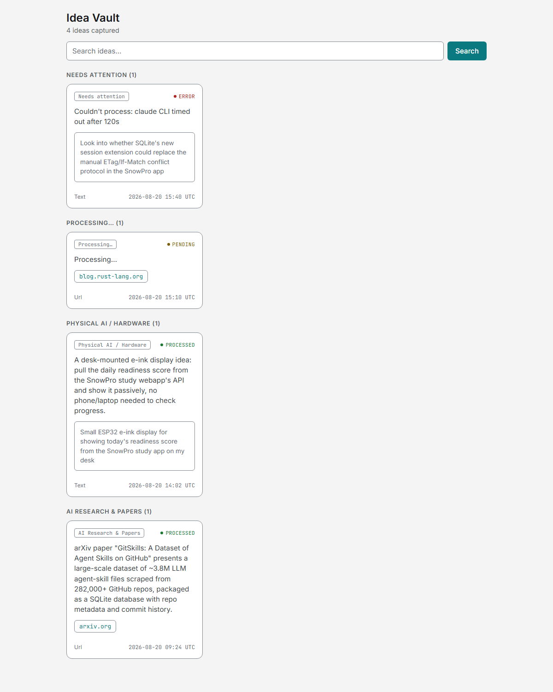
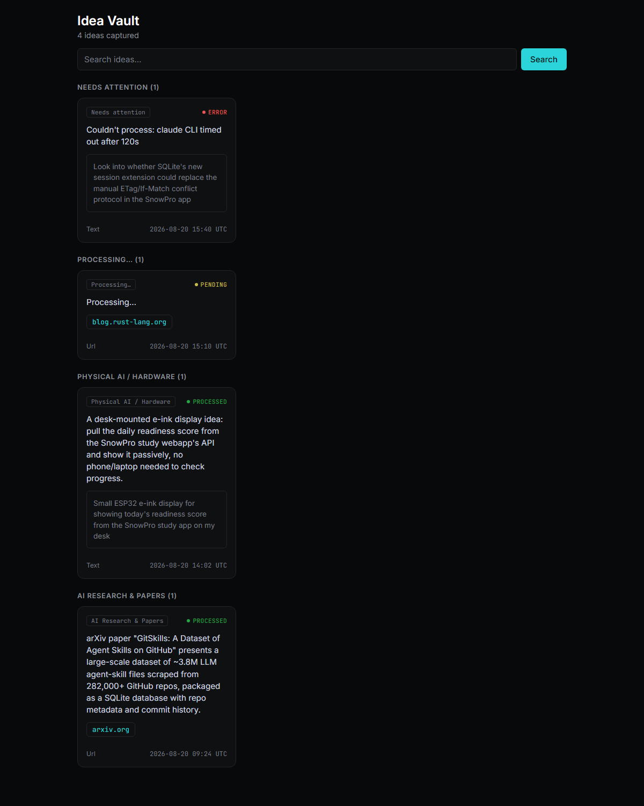

# Idea Vault

A single place to dump every idea, link, or screenshot that crosses your mind — from your phone or
your desktop — and let an AI file it away for you: researched, summarized, and categorized, with
zero manual sorting.

For how each piece of the stack works and why, see [`TECH_STACK.md`](TECH_STACK.md). For
architecture/gotchas aimed at an AI coding agent working on this repo, see [`CLAUDE.md`](CLAUDE.md).

## How it works

1. **Capture** — message a Telegram bot (text, a link, or a photo/screenshot). Works identically
   from mobile or desktop, no app to install beyond Telegram itself.
2. **Process** — the bot researches the idea (web search/fetch for links, or a quick look at an
   image) via headless Claude Code, then writes a short summary and assigns a category, reusing an
   existing category when it fits.
3. **Browse** — a local web dashboard shows everything grouped by category, with search.

```
Telegram (you) --> bot service --> claude -p (headless) --> SQLite --> dashboard service --> you, in a browser
```

## Architecture



The full request path, including the four architectural decisions it turns on: no webhook, a narrow
tool allow-list on the headless process, subscription auth instead of API billing, and SQLite's
rollback journal instead of WAL. Open [`docs/architecture.drawio`](docs/architecture.drawio) in
[draw.io](https://app.diagrams.net/) to edit it, or see the static
[`docs/architecture.drawio.png`](docs/architecture.drawio.png) if your viewer doesn't animate GIFs.

## Screenshots

| Light | Dark |
|---|---|
|  |  |

Sample data shown — cards grouped by category, with a status pill, the original captured link/text
preserved alongside the AI summary, and both a "processing" and an "error" state visible (nothing
silently disappears if something goes wrong).

## Setup

**Prerequisites**

- Docker + Docker Compose
- A Telegram account
- A **Claude Pro or Max subscription** (this project deliberately does *not* use the pay-per-token
  Claude API — see [`CLAUDE.md`](CLAUDE.md) for why)
- The Claude Code CLI installed somewhere you can run `claude setup-token` once (your own machine
  is fine, even if that's not where you'll run this stack)

**Steps**

1. Create your own bot: message [@BotFather](https://t.me/BotFather) on Telegram, send `/newbot`,
   follow the prompts. You'll get a token like `123456789:AAExampleTokenHere`.
2. Generate a long-lived OAuth token for headless automation, tied to your subscription:
   ```
   claude setup-token
   ```
3. Clone this repo, then:
   ```
   cp .env.example .env
   ```
   and fill in `TELEGRAM_BOT_TOKEN` and `CLAUDE_CODE_OAUTH_TOKEN` from the two steps above.
4. Build and start:
   ```
   docker compose up -d --build
   ```
5. Message your bot on Telegram — send it a plain thought, a link, or a photo. It'll reply once
   processed.
6. Open `http://localhost:8090` (or whatever `DASHBOARD_PORT` you set) to browse everything you've
   captured, grouped by category, searchable.

> **Windows one-click launcher (optional).** [`Launch-IdeaVault.ps1`](Launch-IdeaVault.ps1) wraps
> step 4 and step 6 above: it starts Docker Desktop if it isn't already running, brings the
> containers up, waits for the dashboard to respond, then opens it in your default browser. Compile
> it into a double-clickable `.exe` once:
> ```powershell
> Install-PackageProvider NuGet -Scope CurrentUser -Force   # one-time, no admin needed
> Install-Module ps2exe -Scope CurrentUser -Force -AllowClobber
> Invoke-ps2exe -inputFile ".\Launch-IdeaVault.ps1" -outputFile ".\Idea Vault.exe" -title "Idea Vault" -noConsole:$false
> ```
> Keep the resulting `.exe` in this same folder (it locates the project by its own file path), then
> double-click it — or right-click → **Send to → Desktop (create shortcut)** — any time you want to
> open the app. It's unsigned, so Windows SmartScreen may warn on first run; that's expected for a
> personal-project executable you built yourself — click **More info → Run anyway**. If you changed
> `DASHBOARD_PORT` from the default `8090`, update `$AppUrl` at the top of the script to match.

## Configuration

All configuration is environment variables, set in `.env` (see [`.env.example`](.env.example) for
the full list with instructions on obtaining each value):

| Variable | Required | Purpose |
|---|---|---|
| `TELEGRAM_BOT_TOKEN` | yes | Your bot's token from @BotFather |
| `CLAUDE_CODE_OAUTH_TOKEN` | yes | Long-lived token from `claude setup-token`, authorizes headless processing against your subscription |
| `DASHBOARD_PORT` | no (default `8090`) | Host port the dashboard is published on |

No category list, bot identity, or file paths are hardcoded anywhere in the code — every
deployment starts empty and learns its own categories from whatever you actually capture.

## Current limitations (v1)

- **Dashboard is LAN/desktop-only** — no built-in remote access. If you want it reachable away
  from home, put it behind your own tunnel (e.g. a Cloudflare Tunnel) or reverse proxy.
- **No cross-idea linking yet** — each idea is summarized and categorized independently; surfacing
  related ideas or "possibilities" across your collection is planned for a later version, once
  there's enough volume for it to be meaningful.
- **No auth on the dashboard** — by design, for a LAN-only v1. Don't expose it to the open internet
  without adding your own auth layer first.
- **Brief gap after the host machine wakes from sleep** — while the machine is actually asleep, the
  bot processes nothing (Docker is suspended along with the host). For a minute or two after wake,
  you may see repeated network errors in `docker compose logs bot` while the container's DNS
  resolution recovers; this clears on its own with no restart needed. No captures are lost —
  Telegram queues messages server-side, and long-polling fetches the backlog once the bot
  reconnects. See TECH_STACK.md `## 2. Capture` for the mechanism.

## License

MIT — see [`LICENSE`](LICENSE). Use it, fork it, change it.
